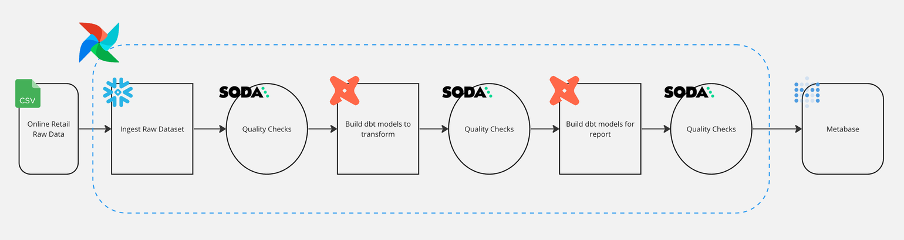
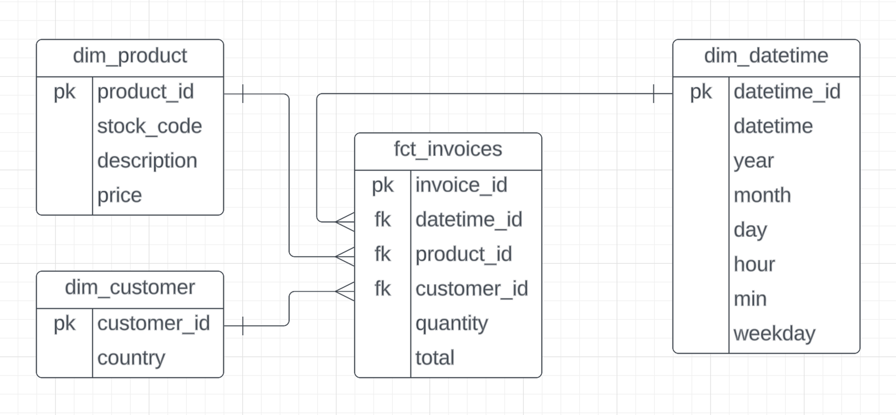

<!-- Reference:
- https://robust-dinosaur-2ef.notion.site/PUBLIC-Retail-Project-af398809b643495e851042fa293ffe5b
- https://astro-sdk-python.readthedocs.io/en/stable/guides/operators.html
- https://registry.astronomer.io/providers/apache-airflow-providers-google/versions/10.12.0/modules/LocalFilesystemToGCSOperator


Overview
========

Welcome to Astronomer! This project was generated after you ran 'astro dev init' using the Astronomer CLI. This readme describes the contents of the project, as well as how to run Apache Airflow on your local machine.

Project Contents
================

Your Astro project contains the following files and folders:

- dags: This folder contains the Python files for your Airflow DAGs. By default, this directory includes two example DAGs:
    - `example_dag_basic`: This DAG shows a simple ETL data pipeline example with three TaskFlow API tasks that run daily.
    - `example_dag_advanced`: This advanced DAG showcases a variety of Airflow features like branching, Jinja templates, task groups and several Airflow operators.
- Dockerfile: This file contains a versioned Astro Runtime Docker image that provides a differentiated Airflow experience. If you want to execute other commands or overrides at runtime, specify them here.
- include: This folder contains any additional files that you want to include as part of your project. It is empty by default.
- packages.txt: Install OS-level packages needed for your project by adding them to this file. It is empty by default.
- requirements.txt: Install Python packages needed for your project by adding them to this file. It is empty by default.
- plugins: Add custom or community plugins for your project to this file. It is empty by default.
- airflow_settings.yaml: Use this local-only file to specify Airflow Connections, Variables, and Pools instead of entering them in the Airflow UI as you develop DAGs in this project.

Deploy Your Project Locally
===========================

1. Start Airflow on your local machine by running 'astro dev start'.

This command will spin up 4 Docker containers on your machine, each for a different Airflow component:

- Postgres: Airflow's Metadata Database
- Webserver: The Airflow component responsible for rendering the Airflow UI
- Scheduler: The Airflow component responsible for monitoring and triggering tasks
- Triggerer: The Airflow component responsible for triggering deferred tasks

2. Verify that all 4 Docker containers were created by running 'docker ps'.

Note: Running 'astro dev start' will start your project with the Airflow Webserver exposed at port 8080 and Postgres exposed at port 5432. If you already have either of those ports allocated, you can either [stop your existing Docker containers or change the port](https://docs.astronomer.io/astro/test-and-troubleshoot-locally#ports-are-not-available).

3. Access the Airflow UI for your local Airflow project. To do so, go to http://localhost:8080/ and log in with 'admin' for both your Username and Password.

You should also be able to access your Postgres Database at 'localhost:5432/postgres'.

Deploy Your Project to Astronomer
=================================

If you have an Astronomer account, pushing code to a Deployment on Astronomer is simple. For deploying instructions, refer to Astronomer documentation: https://docs.astronomer.io/cloud/deploy-code/

Contact
=======

The Astronomer CLI is maintained with love by the Astronomer team. To report a bug or suggest a change, reach out to our support. -->


# Retail Data Pipeline 

## Table of Contents
- [Retail Data Pipeline](#retail-data-pipeline)
  - [Table of Contents](#table-of-contents)
  - [Overview](#overview)
    - [Dataset Description](#dataset-description)
  - [Technologies](#technologies)
  - [Pipeline](#pipeline)
  - [Data Modeling](#data-modeling)
  - [Getting Started](#getting-started)
- [Reference](#reference)


## Overview
This project serves as a comprehensive guide to building an end-to-end data engineering pipeline. The pipeline is built on Apache Airflow and dbt, and is deployed on Astronomer. The data is stored in Google Cloud Storage and BigQuery. The pipeline is built to be modular and scalable, and can be easily adapted to other use cases.

The dataset used in this project is the [Online Retail Data Set](https://www.kaggle.com/datasets/tunguz/online-retail) from Kaggle. This is a transnational data set which contains all the transactions occurring between 01/12/2010 and 09/12/2011 for a UK-based and registered non-store online retail.The company mainly sells unique all-occasion gifts. Many customers of the company are wholesalers.


### Dataset Description
| Column | Description |
| --- | --- |
| InvoiceNo | Invoice number. Nominal, a 6-digit integral number uniquely assigned to each transaction. If this code starts with letter 'c', it indicates a cancellation. |
| StockCode | Product (item) code. Nominal, a 5-digit integral number uniquely assigned to each distinct product. |
| Description | Product (item) name. Nominal. |
| Quantity | The quantities of each product (item) per transaction. Numeric. |
| InvoiceDate | Invice Date and time. Numeric, the day and time when each transaction was generated. |
| UnitPrice | Unit price. Numeric, Product price per unit in sterling. |
| CustomerID | Customer number. Nominal, a 5-digit integral number uniquely assigned to each customer. |
| Country | Country name. Nominal, the name of the country where each customer resides. |

## Technologies
  - Apache Airflow
  - dbt
  - Google Clous Storage, BigQuery
  - Soda
  - Metabase
  - Python
  - Docker, Docker Compose


## Pipeline



## Data Modeling



## Getting Started
1. Clone the repo
2. Create a project on Google Cloud Platform, then create a service account and download the key file
3. Add the key file to the `include/gcp` folder
4. Run 
```bash
astro dev start
```
To start the airflow server. The airflow UI will be available at https://localhost:8080


# Reference
- https://robust-dinosaur-2ef.notion.site/PUBLIC-Retail-Project-af398809b643495e851042fa293ffe5b
- https://astro-sdk-python.readthedocs.io/en/stable/guides/operators.html
- https://registry.astronomer.io/providers/apache-airflow-providers-google/versions/10.12.0/modules/LocalFilesystemToGCSOperator
